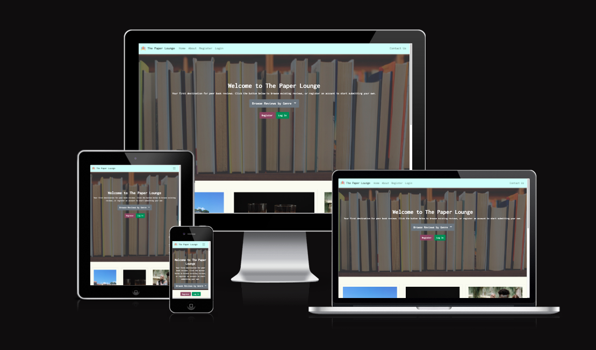
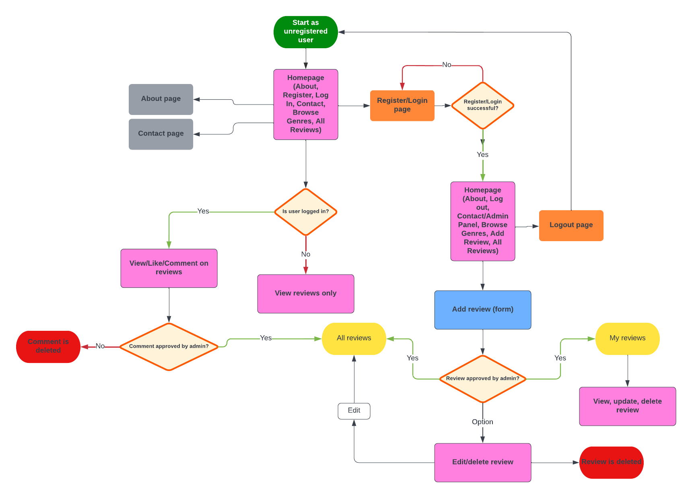
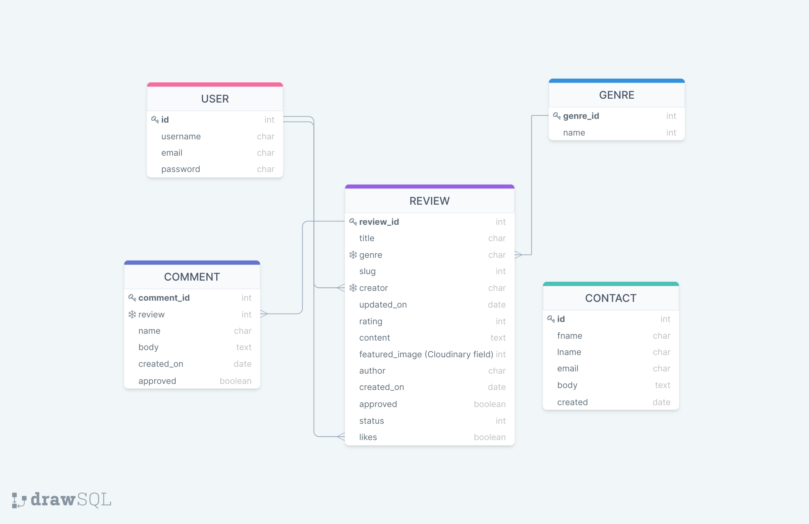

## Table of contents
1. [Introduction](#introduction)
2. [UX](#ux)
3. [The Strategy Plane](#the-strategy-plane)
    1. [User Stories](#user-stories)
    2. [Agile Methodology](#agile-methodology)
4. [The Scope Plane](#the-scope-plane)
5. [The Structure Plane](#the-structure-plane)
6. [The Skeleton Plane](#the-skeleton-plane)
7. [The Surface Plane](#the-surface-plane)
    1. [Colour Scheme](#colour-scheme)
    2. [Typography](#typography)
    3. [Imagery](#imagery)
8. [Features](#features)
    1. [Navigation](#navigation) 
    2. [Footer](#footer)
    3. [Other Features](#other-features)
    4. [Features Left to Implement](#features-left-to-implement)
9. [Testing](#testing)
    1. [Resubmission Testing](#resubmission-testing)
10. [Bugs](#bugs)
    1. [Fixed](#fixed)
    2. [Unfixed](#unfixed)
11. [Technologies Used](#technologies-used)
     1. [Modules](#modules-used-for-the-development-of-this-project)
     2. [Languages](#languages)
     3. [Frameworks](#frameworks)
     4. [Platforms](#platforms)
     5. [Services](#services)
     6. [Resources](#resources)
12. [Deployment](#deployment)
     1. [Initial Deployment](#initial-deployment)
     2. [Final Deployment](#final-deployment)
13. [References](#references)
    1. [Code](#code)
14. [Credits](#credits)
     1. [Media](#media)
     2. [Acknowledgements](#acknowledgements)
***

# Introduction

The Paper Lounge is a community orientated blog for book lovers, where you can browse and read reviews, or write and submit you own. It is the perfect place to find your next favourite book, and discuss literature with fellow book worms. 

Browse through the genres to find reviews specific to your interests, or share your own reviews to help others decide on what to read next. 

The Paper Lounge has been built using the Django Framework in Python, JavaScript, HTML and CSS. It provides user authentication and full CRUD functionality. 

<a href="https://the-paper-lounge.herokuapp.com/" target="_blank" rel="noopener" aria-label="Link to open deployed site">Link to deployed site</a>

***
# UX

# The Strategy Plane

This application has been produced for Porfolio Project 4, as part of the Code Institute Diploma in Full-Stack Software Development. The project aims to demonstrate skills learnt in HTML, CSS, Python and JavaScript using the Django framework. 

The main aim of the website is to provide an online community for book lovers, where they can find reviews of books they have not yet read to help inform their reading choices, or post reviews of their own to share experiences and opinions of books they have read. 

General users can:
- Browse and read existing reviews.
- Send messages to the admin via the contact form.

In addition, registered users can:
- Create, update and delete their own reviews.
- Like and comment on other user's reviews. 

The admin can:
- Access the admin panel from the navigation bar when logged in. 
- Create, update and delete their own reviews from the main site, or the admin panel. 
- Approve and publish reviews and comments from users via the admin panel. 
- Create, update and delete genres via the admin panel. 
- Manage users and associated content via the admin panel. 

The target audience for this website is:
- People who want to share their thoughts and opinions on books they have read. 
- People who are looking generally for book recomendations. 
- People who want to find new books to read of a specific genre. 
- People who want to read more, and are looking for recomendations on what titles may be good to start with. 

## User Stories

## As a site user or admin:
- I can create book reviews to share with other users.
- I can see if my review has received any comments and/or likes so that I can see the engagement with my review.
- I can update and delete reviews written by me so that I can manage my own content. 
- I can like or unlike a review so that I can interact with the content.
- I can post comments on existing reviews so that I can express my thoughts and opinions.

## As a site user: 
- I can navigate easily around the site so that I can find the information and functionality I am looking for quickly and easily.
- I can read about the blog so that I can find out more information about the blog. 
- I can view and click on different genre categories so that I can find reviews relevant to my specific reading interests.
- I can click into individual reviews so that I can read them fully.
- I can see if any new reviews have been added so that I can read new content.
- I can fill out and submit a contact form so that I can make admin aware of any issues or feedback.
- I can register for an account to be able to post reviews and comments.
- I can login to the website so that I can post reviews and comments.
- I can log out my account to ensure security on any shared devices I may use.

## As a site admin:
- I can access the admin panel from the navigation bar when logged in so that I don't have to manually type the URL each time.
- I can approve reviews and comments so that suitability of content can be ensured.
- I can manage genres so that I can add to, modify or remove them.
- I can view messages submitted via the contact form so that I can communicate with site users.
- I can remove users so that they will no longer be able to post unsuitable content.

## Agile Methodology

The development of this project was managed and implemented using GitHub Projects Kanban Board. Available here:
<a href="https://github.com/cornishcoder1/the_paper_lounge/projects/1" target="_blank" rel="noopener" aria-label="Link to GitHub Projects">The Paper Lounge - User Stories</a>

 

# The Scope Plane

Site goals:
- To provide the user with a platform to find book reviews and recommendations. 
- To provide a visually pleasing and engaging website where the purpose is immediately clear, and is easy to navigate. 
- To provide role-based permissions to allow users to create, review, update and delete their own reviews. The admin can approve, manage and remove content and users. 

Features planned:
- Visually appealing design. 
- Intuitive and easy to use navigation. 
- Role-based navigation for different users. 
- Book reviews - Registered users can create, review, update and delete their own reviews. 
- Browse by genre - All users can browse reviews by genre. 
- Comments and likes - Registered users can like and comment on reviews. 
- User register, log in and log out. 
- Custom error pages. 

# The Structure Plane

Flowchart

Database Schema

Three custom models were used for the website, Review, Genre and Comment. Two built in models were used for User and Contact. Django AllAuth was used for user authentication. 

# The Skeleton Plane

Wireframes:

All wireframes for the project can be found [here](./assets/wireframes/)

 

# The Surface Plane

## Colour Scheme

I wanted the main colours of the site to be calming and neutral, hence the use of the light cyan and ivory tones. Buttons were styled in bolder colors, with the 'browse reviews by genre' dropdown button and submit/send buttons being a dark grey, and the 'add review here' and register buttons a mauve colour. The login and edit buttons are kept green in keeping with bootstrap styling, as is the red delete button. 

## Typography 

The font used throughout the website is 'Inconsolata' from <a href="https://fonts.google.com/specimen/Inconsolata#standard-styles" title="Google Fonts">Google Fonts</a>. What I liked about this font was it's 'typewriter' look, which I felt was a good style fit for a book review website. 

## Imagery

For the homepage hero image I used an image of books on a shelf. This helps the user identify quickly what the website is about. I darkened the image so that the white text on top stood out and was more visible. 

For the placeholder image (if a user does not upload their own image when submitting a review), I used an image of an open book. The image is stylish and neutral in colour, which is ideal for a placeholder which may appear multiple times on a page. I also used this image as the masthead for the genre pages. 

All other images present on the site will be chosen by users. The admin can change or remove images that are inappropriate, before approving and publishing reviews to the main site. 
***

# Features

## Navigation

There are three role-based navigation bars, depending on the user.

- Navigation 1 - Unregistered/logged out users

This navbar allows the user to access the homepage, about and the contact form. It also gives them access to the register and login pages. 

- Navigation 2 - Registered users

This navbar does not include access to the register page, but instead to the log out page. 

- Navigation 3 - Admin

This navbar replaces the link to the contact form, with a link directly to the admin panel. This means that the admin does not have to manually type the url into the browser every time they want to access it.

## Footer 

The footer is kept simple with minimal styling, although the icons do change colour to mauve on hover. The icons link to the associated social media sites, although in a real world situation they would link to The Paper Lounge accounts on each platform. 

## Other Features

- Home page - This has a hero image, with a title, description of the site and the 'Browse Reviews by Genre' dropdown button. It also features register and login buttons. Once a user is registered and logged in, these buttons are replaced by the 'Add Review' button. Below this, all reviews will show ordered by date published (newest first).

- About page - This page is available to all users, and gives a brief description of the site and community rules. 

- Register/Login/Logout - Django AllAuth allows users to securely log into the site and gain access to functionality only available to registered users. Users receive feedback in the form of pop-up messages when they are registered, logged in and logged out successfully. 

- Contact Us - All users can submit a contact from which goes to the admin. This allows them to report issues, give feedback or suggest new features. Users receive feedback in the form of a pop-up message when a form is sent successfully. All fields are marked as mandatory and must be completed before the user can submit the form. 

- Browse Reviews by Genre - The dropdown button allows users to navigate to genre specific pages, and view reviews submitted under that genre only. If no reviews are listed on a particular genre page, this is communicated to the user in the main body of the page. Also, if a user tries to access a genre that does not exist (by typing an invalid slug into the URL), they will be informed in the main body of the resulting page. 

- Add/Edit Review - This form allows users to write and submit their own reviews, apply genres and ratings, and upload an image to accompany the review. If an image is not uploaded, then the placeholder image will appear on that review when published. All fields are marked as mandatory and must be completed before the user can submit the form. 

- Review Cards - All reviews first appear on the homepage and genre pages as cards. The book title can be clicked to open the review detail page. The cards feature the review image, reviewer name, book title and author, date and time of publication and number of likes. 

- Review detail - Once opened the review detail page shows the image as a masthead with the book title and reviewer name on top. It then shows the body of the review, star rating and number of likes. Approved comments are then listed below, with the comment form showing for logged in users. Users receive feedback in the form of a pop-up message when a comment has been successfully submitted for approval. The body field is mandatory and must be completed before the user can submit the comment form. 

## Features Left to Implement

- Implement more features of AllAuth, particularly around changing and resetting passwords. 
- Add a Forum app so that users could have better discussion and engagement with each other. Currently they are only able to comment on each others reviews which limits interaction and engagement.
- Allow users to add new genres themselves, rather than only the admin being able to do this. This was out of scope for the current project. 
***

# Testing

- All testing documentation can be found [here](/TESTS.md)
***

## Resubmission Testing

- All resubmission testing documents can be found [here](/TESTS_RESUBMISSION.md)

# Bugs

## Fixed
- Initial deployment to Heroku failed.
    - Upon opening the app in Heroku for the first time after initial deployment, an Application Error was presented. By using the 'heroku logs --tail' command in the terminal, I was able to determine that I had written my application name in the wrong format in Line 1 of the Procfile (I had included underscores in the wsgi file name). I corrected the filename to 'thepaperlounge.wsgi' and upon re-opening the app after commiting the change, the Django successful install page was displayed. 

- Ability to like a review failed.
    - Upon attempting to like a review, I was taken to an error page which stated that 'reverse' was an undefined variable. Upon checking the views.py file, I realised that I had forgotten to import the 'reverse' django shortcut. Once I had added the import to the top of the file (line 1), I was able to like a review without error. 

- add_review.html not found (404 error).
    - When defining the URL path for this page in blog.urls.py and attempting to render, I was presented with a 404 error. This was because ‘add-review’ was being treated as the slug expected by the review_detail view. I changed the order of the paths, placing the 'add_review' path above the 'ReviewDetail' path in the URL patterns list. This fixed the problem and allowed the page to render.

- Add Review button not displaying on small screens horizontally.
    - During responsiveness testing, I noticed that the Add Review button was disappearing on small screens, when viewed horizontally. To fix this I added a top margin of 50px to the container below to allow more room for the button. The button does slip down from the hero image, but it is functional and still looks presentable. 

- Like icon overlapping with Comments icon on small screens.
    - On small screens the two icons were overlapping, so to remedy this I moved the total number of comments icon and number to the bottom of the comments container. This is more visually appealling and fixes the issue of overlap. 
   

## Unfixed

No notable bugs have been found to remain and the website functions as expected. 
***

# Technologies Used

## Modules used for the development of this project: 
    - asgiref==3.5.1
    - cloudinary==1.29.0
    - dj-database-url==0.5.0
    - dj3-cloudinary-storage==0.0.6
    - Django==3.2.13
    - django-allauth==0.50.0
    - django-contact-us==1.0.0
    - django-crispy-forms==1.14.0
    - django-summernote==0.8.20.0
    - gunicorn==20.1.0
    - oauthlib==3.2.0
    - psycopg2==2.9.3
    - PyJWT==2.4.0
    - python3-openid==3.2.0
    - pytz==2022.1
    - requests-oauthlib==1.3.1
    - sqlparse==0.4.2

## Languages
- HTML - required to render templates
- CSS - required for custom styling
- JavaScript - required for automatic dismissal of pop-up messages
- Python - The base language of the Django Framework

## Libraries
- Bootstrap - used for various components including:
    - Navbar - navigation bars
    - Buttons - all buttons throughout the site
    - Cards - review cards
    - Modal - delete modal
    - Grid/Containers/Columns/Rows - to configure the layout of elements

## Frameworks
- Django - Full Stack Framework

## Platforms
- Cloudinary - Storage of static files for deployed site 
- Github - Repository with Git version control
- GitPod - IDE used for development 
- Heroku - Platform for final deployed version of site

## Services
- [Coolors.co](https://coolors.co/) - Presentation of colors for README
- [DrawSQLapp](https://drawsql.app/) - Development of database schema
- [Favicon](https://favicon.io/) - Generation of favicon
- [FontAwesome](https://fontawesome.com/) - Icons used for UX purposes
- [GoogleFonts](https://fonts.google.com/) - 'Inconsolata' font used throughout site
- [LucidChart](https://www.lucidchart.com/) - Development of flowchart
- [Mycolor.space](https://mycolor.space/) - Generation of color palettes

## Resources
- The Code Institute's Codestar Blog walkthrough project was used in the beginning stages of the project to help get me started. I then customised and added further functionality as my confidence and knowledge grew. 
- Django documentation was relied on for additional functionality (e.g. the dropdown button and different navigation bars). 
- W3C Schools and Stack Overflow for general enquiries relating to HTML and CSS. 
- Youtube videos - particularly those from Very Academy and Codemy.com. 
***

# Deployment

## Initial Deployment

In Gitpod: 
1. Create a new repository from the CI full template 
2. To install Django, supporting libraries and dependencies, run the following commands in the terminal: 
    - Run command 'pip3 install 'django<4' gunicorn' to install Django and associated server
    - Run command 'pip3 install dj_database_url psycopg2' to install supporting libraries
    - Run command 'pip3 install dj3-cloudinary-storage' to install Cloudinary
    - Run command 'pip3 freeze --local > requirements.txt' to update requirements file
3. To create a new Django project and blog app, run the following commands in the terminal: 
    - Run command 'django-admin startproject thepaperlounge .' (The Paper Lounge is the name of my project) 
    - Run command 'python3 manage.py startapp blog' 
4. Add 'blog' to INSTALLED_APPS list in settings.py file
5. Migrate changes to the database with the following command in the terminal: 
    - 'python3 manage.py migrate'
6. Open project in the browser and check installation was successful with the following command in the terminal: 
    - 'python3 manage.py runserver' 

In Heroku: 
1. Create a new app in Heroku
2. Go to 'Resources' tab and add add-on 'Heroku Postgres' 
3. Go to 'Settings' tab and reveal config vars. Copy the DATABASE_URL

In Gitpod:
1. Create env.py file and paste DATABASE_URL: 
    - os.environ["DATABASE_URL"] = "your DATABASE_URL here"
2. Add SECRET_KEY to env.py:
    - os.environ["SECRET_KEY"] = "your SECRET_KEY here"
3. Configure database path and secret key in settings.py to be accessed from environment variables 
4. Migrate changes to the database with the following command in the terminal: 
    - 'python3 manage.py migrate'
5. Go to Heroku 'Resources' tab and click on 'Heroku Postgres' to see migrations
6. Perform a commit and push to GitHub 

In Cloudinary: 
1. Copy API Environment Variable from Cloudinary dashboard

In Gitpod
1. Paste API environment variable into env.py:
    - os.environ["CLOUDINARY_URL"] = "you API environment variable here"

In Heroku
1. Add a new config var in 'Settings'. Paste API environment variable into VALUE, and set KEY as CLOUDINARY_URL 

In Gitpod: 
1. In settings.py, add the following:
    - Cloudinary to the INSTALLED_APPS list
    - STATICFILE_STORAGE
    - STATICFILES_DIRS
    - STATIC_ROOT
    - MEDIA_URL
    - DEFAULT_FILE_STORAGE
    - TEMPLATES_DIR
    - Update DIRS in TEMPLATES with TEMPLATES_DIR
    - Update ALLOWED_HOSTS with ['the-paper-lounge.herokuapp.com', 'localhost']
2. Create 'media', 'static' and 'templates' folders, in the top level of file directory 
3. Create a 'Procfile' in the top level of the file directory 
4. In the Procfile, add the following code: 
    - web: gunicorn thepaperlounge.wsgi

**IMPORTANT - At the time of working on this project. Direct linkage of GitHub with Heroku was unavailable, due to a security attack on Heroku services. Therefore, the following steps were used as a work-around:**

5. Log into Heroku from the terminal with the following command: 
    - 'heroku login -i' (enter username and p/w as prompted)
6. Connect Heroku and Github by running the following command in the terminal:  
    - 'heroku git:remote -a the-paper-lounge' 
7. Confirm connection by running the following command in the terminal: 
    - 'git remote -v' (fetch and push should display for both heroku and origin/GitHub)
8. From this point forward, all commits should be pushed to both GitHub and Heroku with the following group of commands in the terminal:
    - 'git add .' 
    - 'git commit -m "commit message"' 
    - 'git push origin main' 
    - 'git push heroku main' 
9. Open app in Heroku once deployment is completed, to insure installation was successful 
    
## Final Deployment
In Gitpod:
1. Ensure all files are up to date.
2. Ensure 'DEBUG = FALSE' in settings.py
3. Add "X_FRAME_OPTIONS= 'SAME ORIGIN'" to settings.py, to ensure that summernote editor works in deployed project.
5. Add, commit and push deployment commit to GitHub.

In Heroku: 
1. Go to 'Settings' tab and reveal config vars. Remove COLLECT_STATIC environment variable. 
2. Go to 'Deploy' tab and scroll down to 'Deploy Branch' (ensure github repo is connected). Run deployment. 
3. Wait for confirmation that application has deployed. 
***

# References 

## Code
1. Stack Overflow - <a href="https://stackoverflow.com/questions/38963193/auto-populate-slug-field-django"> how to auto-populate the Review model slugfield.</a>
2. Stack Overflow - <a href="https://stackoverflow.com/questions/7682804/django-model-forms-setting-a-required-field"> how to set a required field on a Django model form.</a>
3. Very Academy - <a href="https://www.youtube.com/watch?v=S9-Bt1JgRjQ"> Learn Django - Building a Simple Blog Categories Feature</a>
***

# Credits

## Media
- Bookshelf icon by <a href="https://www.freepik.com" title="Freepik">Freepik</a> on <a href="https://www.flaticon.com/" title="Flaticon">Flaticon</a>

- Placeholder image by <a href="https://www.pexels.com/@caio/" title="Caio">Caio</a> on <a href="https://www.pexels.com/" title="Pexels">Pexels</a>

- Hero image by <a href="https://unsplash.com/@jruscello" title="Jessica Ruscello">Jessica Ruscello</a> on <a href="https://unsplash.com/" title="Unsplash">Unsplash</a>

- Rum image by <a href="https://www.pexels.com/@disguise-truth/" title="Anastasia Zhenina">Anastasia Zhenina</a> on <a href="https://www.pexels.com/" title="Pexels">Pexels</a>

- Zombie image by <a href="https://www.pexels.com/@cottonbro/" title="Cotton Bro">Cotton Bro</a> on <a href="https://www.pexels.com/" title="Pexels">Pexels</a>

- Train image by <a href="https://www.pexels.com/@gabriela-palai-129458/" title="Gabriela Palai">Gabriela Palai</a> on <a href="https://www.pexels.com/" title="Pexels">Pexels</a>

- Alice in Wonderland image by <a href="https://www.pexels.com/@moldyvintagephoto/" title="Moldy Vintages">Moldy Vintages</a> on <a href="https://www.pexels.com/" title="Pexels">Pexels</a>

- Lakehouse image by <a href="https://www.pexels.com/@moniaes/" title="Monia Sciubilecka">Monia Sciubilecka</a> on <a href="https://www.pexels.com/" title="Pexels">Pexels</a>

- About page image by <a href="https://www.pexels.com/@emrecan/" title="Emre Can Acer">Emre Can Acer</a> on <a href="https://www.pexels.com/" title="Pexels">Pexels</a>

- Sample review text from book blurbs and Wikipedia. 

- All other images currently present on the site belong to myself. 

## Acknowledgements
- Ed B_alum for helping me fix a 404 error. 

- Franciska from Tutor Support for helping me get my navbar drop down working. 

- Ed from Tutor Support for your patience and help in error handing non-existent genre pages. 

- Lisa Tinmurth and John from Tutor Support for helping me with my delete modal code. 

- The CI Slack Community for an invaluable archive of help! 
